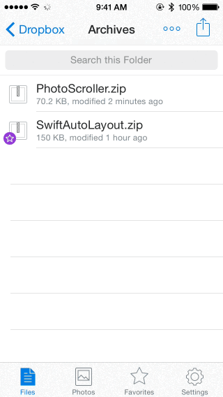

## Unzip
### iOS 8 Action Extension for browsing ZIP files



This was going to become a real product until I found out that [iOS 7 added native support for ZIP files](http://www.macworld.com/article/2049370/ios-7-adds-support-for-zipped-attachments-in-mail-messages-with-quick-look.html). Nonetheless, it's a good example of how action extensions can be used to not only extend the functionality of standalone apps, but to extend the functionality of the OS as well.

### Getting Started

Requires [CocoaPods](http://cocoapods.org) to manage dependencies.

```
$ cd Unzip
$ pod install
```

Open **Unzip.xcworkspace**. The **Unzip** app itself doesn't contain anything, everything is implemented in **UnzipAction**.

### Contact

* Indragie Karunaratne
* [@indragie](http://twitter.com/indragie)
* [http://indragie.com](http://indragie.com)

### License

Unzip is licensed under the MIT License.